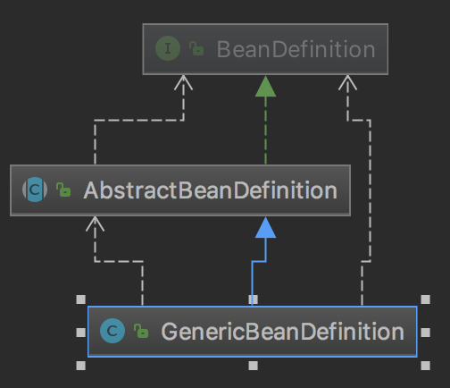

#### Spring bean 装配过程研究

#### Spring 对于 bean 的管理能力定义

和所有面向对象语言的思路一样， Spring 对于 bean 的管理能力， 实际上主要提现在以下几方面的能力

1. bean 的定义能力
2. 从不同的数据源构造 bean 定义的能力
   1. xml 文件
   2. annotation 注解
3. 容器管理能力 applicationContext
4. bean 向容器注册能力

##### bean 定义能力

BeanDefinition 结构如图

